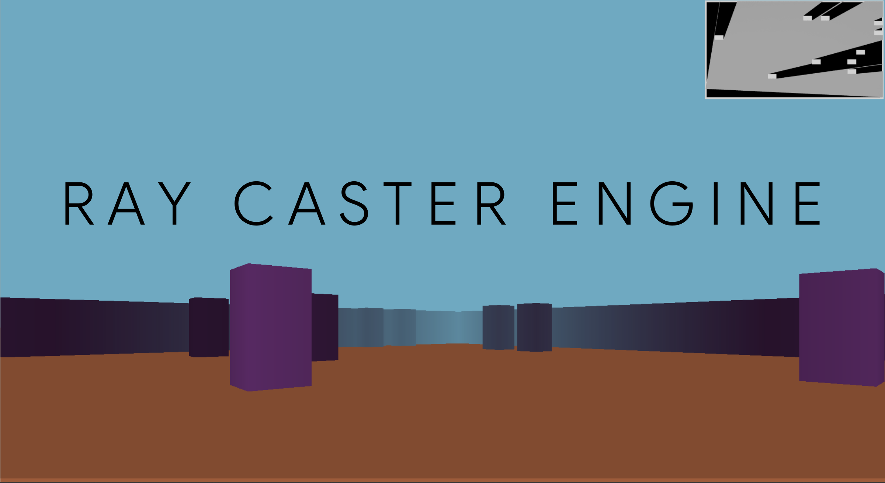
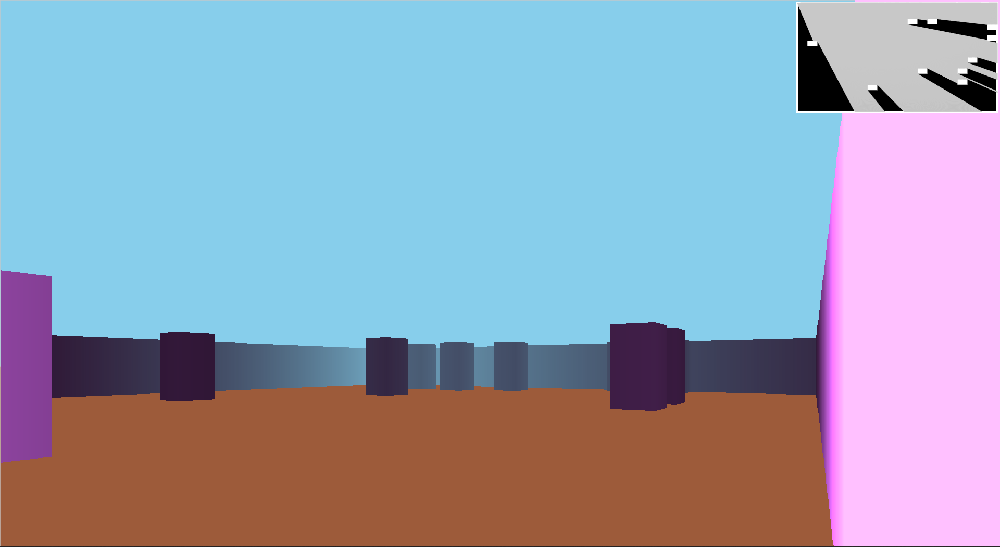
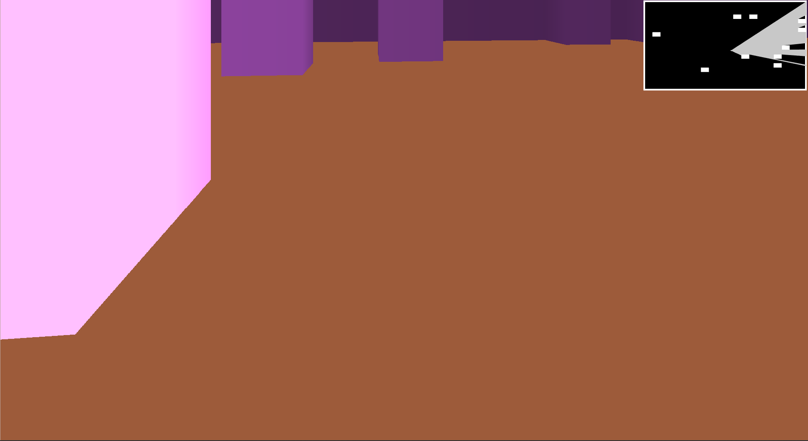
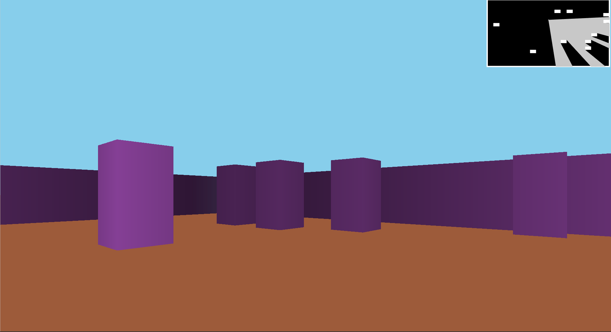
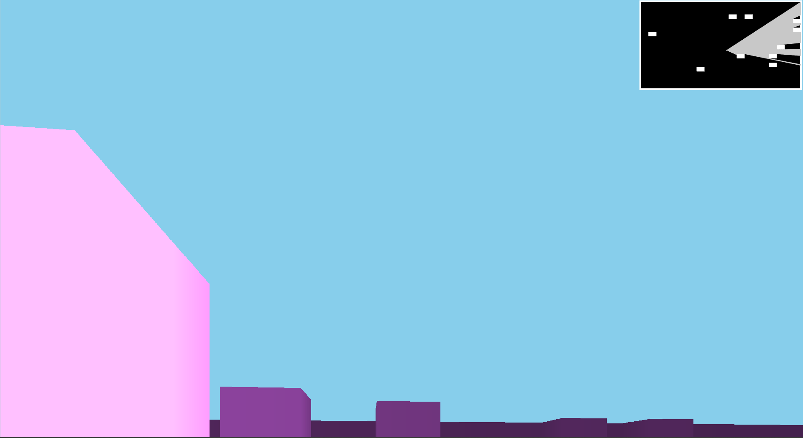

# 3D Ray Caster Engine

#### A 3D ray caster engine made from scratch in java

#### [View Demo on YouTube](https://youtu.be/csJf_iHPrm0)

###### See also
[Ping Pong Online Multiplayer](https://github.com/ChauhanRohan-RC/Ping-Pong-AI.git)  
[3D N*N Rubik's Cube solver-AI](https://github.com/ChauhanRohan-RC/Cube.git)  
[Fourier Series Simulation](https://github.com/ChauhanRohan-RC/Fourier-Series.git)  

## Features
* Efficient Ray Tracking Algorithm with native Vector calculations and Collision mesh detection
* Real time player and 3D camera motion
* Includes Minimap that displays 
  * Walls and Boundaries
  * Position of the player i.e rays source
  * Rays emitting from the player
  * Heading and collision mesh of each rays
* Fog effect : walls become foggy at large distances
* Corrected fish-eye effect
* Player heading directed motion controls

## Controls
* Player controls
  * `W` : Move Forward
  * `A` : Move Left
  * `S` : Move Backward
  * `D` : Move Right
#####
* Camera Controls
  * `UP` : Camera Up
  * `DOWN` : Camera Down
  * `LEFT` : Camera Left
  * `RIGHT` : Camera Right
#####
* Scene Controls
  * `CTRL-R` : Change Scene

## Usage
Requires Java 14 or higher
* Install [Java](https://www.oracle.com/in/java/technologies/downloads/) on your computer and add it to the path
* Clone this repository  
  `git clone https://github.com/ChauhanRohan-RC/RayCaster.git`
* Navigate to [RayCaster_jar](out/artifacts/RayCaster_jar) folder and run [launch.bat](out/artifacts/RayCaster_jar/launch.bat).  
  Alternatively, open up the terminal and run `java -jar RayCaster.jar`

## Connect on

[GitHub](https://github.com/ChauhanRohan-RC)  
[Twitter](https://twitter.com/0rc_studio)  
[Youtube](https://www.youtube.com/channel/UCmyvutGWtyBRva_jrZfyORA)  
[Google Play Store](https://play.google.com/store/apps/dev?id=7315303590538030232)  
E-mail: com.production.rc@gmail.com

